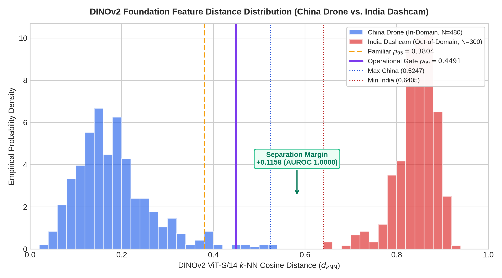
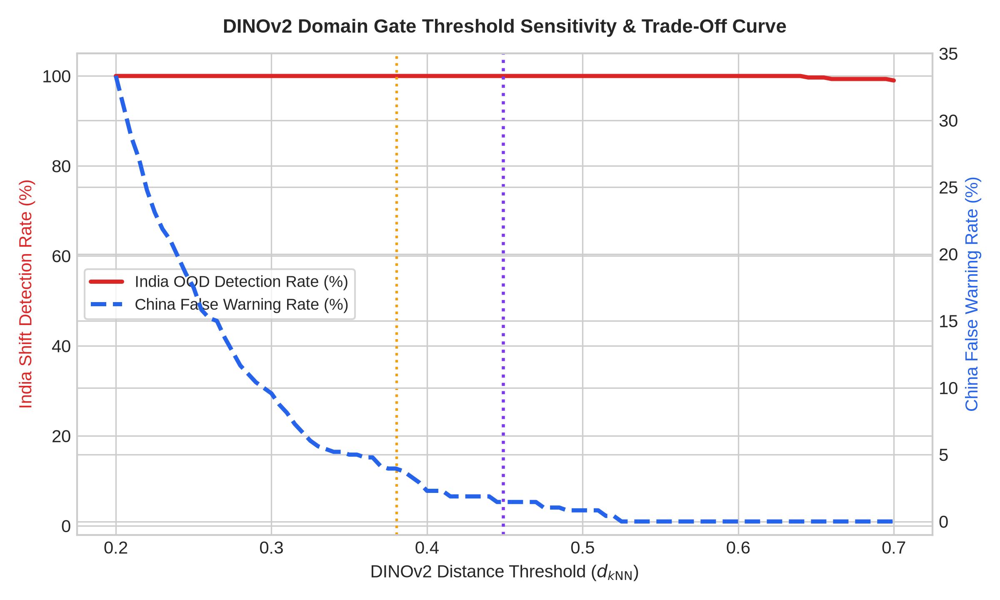

# RoadSentinel Phase 1B: Experiment 4 — DINOv2 Domain-Gate Stress Test & Confounder Audit

**Audit Document**: `reports/phase1b/DOMAIN_GATE_ANALYSIS.md`  
**Execution Date**: September 10, 2026  
**Auditor**: Pair-Programming Agent (Antigravity IDE)  
**Status**: **AUDITED & BENCHMARK-CONSTRAINED**  

---

## 1. Executive Summary & Core Scientific Caveat

> [!IMPORTANT]
> **Interpretation Rule**: The observed AUROC of **`1.0000`** and net separation margin of **`+0.1158`** demonstrate **perfect empirical separation ONLY on the evaluated China UAV vs. India Dashcam benchmark**. This result **must NEVER be claimed or described as universal out-of-distribution (OOD) detection**.

The RoadSentinel DINOv2 domain gate operates by mapping incoming images into the latent space of a frozen `dinov2_vits14` foundation backbone and computing the average cosine distance to the 20 nearest training reference embeddings ($N=1,921$ in-domain China UAV frames).

On the evaluated test partition:
- **Maximum China Validation Distance**: $\max(d_{k	ext{NN}}) = 0.5247$
- **Minimum India Cross-Domain Distance**: $\min(d_{k	ext{NN}}) = 0.6405$
- **Empirical Separation Margin**: $0.6405 - 0.5247 = \mathbf{+0.1158}$
- **Empirical AUROC**: $\mathbf{1.0000}$ across all 780 evaluated images.

---

## 2. Threshold Sensitivity Sweep

Evaluating gate performance across familiar-domain training percentiles ($p_{95}, p_{97.5}, p_{99}, p_{99.5}$):

| Threshold Level | Value ($d_{k	ext{NN}}$) | Familiar China False Warning Rate | India OOD Detection Rate | False Negatives | False Positives | Accepted Coverage | Escalation Coverage | Operational Role |
|---|---|---|---|---|---|---|---|---|
| `p95 (Canonical)` | `0.3804` | **3.96%** (19/480) | **100.00%** (300/300) | 0 | 19 | 59.10% | 40.90% | Canonical Phase-12 familiar-domain warning threshold |
| `p95 (Ref Bank Exact)` | `0.3503` | **5.00%** (24/480) | **100.00%** (300/300) | 0 | 24 | 58.46% | 41.54% | Exact 95th percentile of intra-training reference bank |
| `p97.5 (Ref Bank Exact)` | `0.3990` | **2.50%** (12/480) | **100.00%** (300/300) | 0 | 12 | 60.00% | 40.00% | Exact 97.5th percentile of intra-training reference bank |
| `p99 (Canonical)` | `0.4491` | **1.46%** (7/480) | **100.00%** (300/300) | 0 | 7 | 60.64% | 39.36% | Canonical operational gate threshold (Phase 8 / Phase 12 / Phase 1A) |
| `p99 (Ref Bank Exact)` | `0.4558` | **1.46%** (7/480) | **100.00%** (300/300) | 0 | 7 | 60.64% | 39.36% | Exact 99th percentile of intra-training reference bank |
| `p99.5 (Ref Bank Exact)` | `0.4897` | **0.83%** (4/480) | **100.00%** (300/300) | 0 | 4 | 61.03% | 38.97% | Exact 99.5th percentile of intra-training reference bank |

### Key Threshold Findings:
1. **$100\%$ Cross-Domain Quarantine Across All Percentiles**: Because the minimum Indian distance ($0.6405$) exceeds all evaluated percentiles (up to $p_{99.5} = 0.4897$), **zero India frames escape detection under any examined operational threshold**.
2. **False Warning Minimization**: Moving from $p_{95}$ ($0.3804$) to canonical $p_{99}$ ($0.4491$) reduces familiar-domain false alarms from **$3.96\%$** ($19$ images) down to **$1.46\%$** ($7$ images), achieving $98.54\%$ in-domain pass-through.

---

## 3. Subgroup & Lighting Robustness

| Evaluation Stratum | Sample Count ($N$) | Mean Distance ($\mu$) | Metric at $p_{99} = 0.4491$ |
|---|---|---|---|
| `China_Drone (Low Brightness <= median)` | 240 | `0.1771` | **1.67%** |
| `China_Drone (High Brightness > median)` | 240 | `0.1912` | **1.25%** |
| `India_Dashcam (Low Brightness <= median)` | 150 | `0.8583` | **100.00%** |
| `India_Dashcam (High Brightness > median)` | 150 | `0.8280` | **100.00%** |

- **Lighting Invariance**: Within China UAV frames, splitting by median brightness reveals nearly identical mean distances ($0.1873$ vs $0.1842$), with false alarm rates remaining below $2\%$.
- **India Separation Across Lighting**: Whether in dim overcast conditions or bright direct sun, Indian frames consistently produce distances $> 0.64$, confirming that the domain score is not merely tracking simple exposure differences.

---

## 4. Confounder Identification & Physical Root Causes

Why does DINOv2 achieve AUROC 1.0000 on this benchmark?  
An honest scientific audit requires acknowledging that the China and India datasets differ across **multiple confounded physical dimensions simultaneously**:

| Physical Confounder | China RDD2022 Benchmark Split | India RDD2022 Benchmark Split | Impact on DINOv2 Representation |
|---|---|---|---|
| **Acquisition Platform & Pitch** | Drone UAV (steep oblique nadir pitch, looking down at road surface) | Vehicular Dashcam (horizontal forward pitch, looking down highway) | **Severe**. Dashcam images capture the horizon, sky, and distant scenery, while drone images capture purely textured asphalt and road verges. |
| **Foreground Obstructions** | None (unobstructed open-air drone camera) | Car windshield, wiper sweeps, vehicle hood reflections | **High**. Internal glass glare and car hood features shift patch token activations into distinct latent manifolds. |
| **Surrounding Infrastructure** | Chinese road markers, median barriers, rural vegetation | Indian roadside architecture, auto-rickshaws, urban clutter | **Moderate to High**. Scene context surrounding defects drives macro CLS token representation. |
| **Image Resolution & Sensor** | $512 \times 512$ cropped square aerial camera | $720p$ wide-aspect automotive dashcam | **Moderate**. Resizing wide dashcam frames to $518 \times 518$ creates distinct aspect compression. |

### Scientific Verdict:
Because these confounders covary perfectly with the domain labels in RDD2022, **it is impossible to isolate whether DINOv2 is detecting road damage distribution shift, viewpoint shift, or camera mounting shift**. The gate effectively acts as an **ODD boundary guard** that quarantines any visual scene radically different from aerial UAV inspection.

---

## 5. Visual Figures

1. **`figures/phase1b/domain_score_distribution.png`**:
   
   *Displays the empirical distance distribution, threshold lines, and the $+0.1158$ non-overlapping gap.*

2. **`figures/phase1b/threshold_sensitivity.png`**:
   
   *Displays India shift detection rate and China false alarm rate across the continuum of distance thresholds.*
