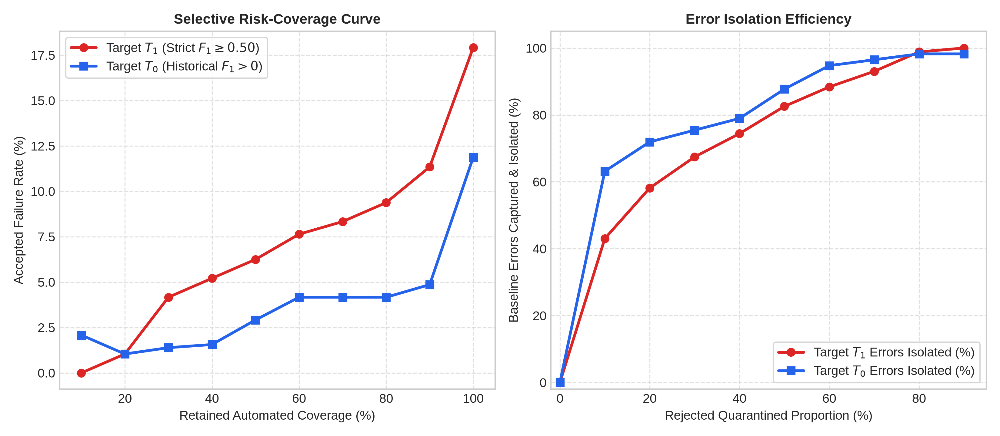
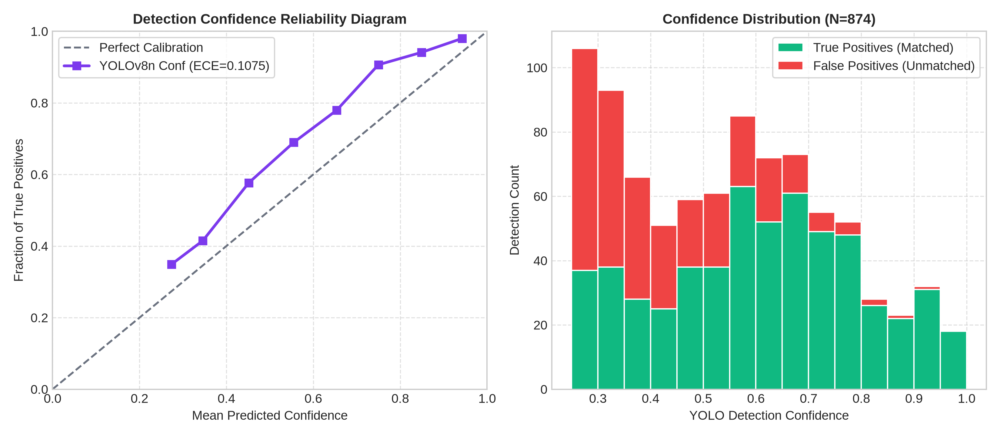

# RoadSentinel Phase 1B: Experiment 5 — Reliability & Risk-Coverage Analysis

**Audit Document**: `reports/phase1b/RELIABILITY_ANALYSIS.md`  
**Execution Date**: September 10, 2026  
**Auditor**: Pair-Programming Agent (Antigravity IDE)  
**Status**: **VERIFIED & AUDITED**  

---

## 1. Executive Summary & Algorithmic Reconciliation

This evaluation audits the reliability-aware selective prediction subsystem across the full spectrum of rejection rates ($0\%$ to $90\%$ in $10\%$ increments) and reconciles historical metrics with reproducible raw records.

### 1.1 Architectural Definitions
1. **Pure Reliability Rejection**: Selective prediction based strictly on sample-level confidence features (Model B out-of-fold predicted probability on Target $T_1$, $F_1 \ge 0.50$), without domain filtering. Observations are sorted in descending order of reliability, and the lowest $R\%$ are quarantined.
2. **Domain Gating**: Standalone macro-level distribution shift quarantine based on DINOv2 20-NN cosine distance ($p_99 = 0.4491$). Flags $100\%$ of out-of-domain India dashcam frames and exhibits a $1.46\%$ familiar false warning rate.
3. **Combined Gated Reliability**: The sequential staged pipeline where domain gating precedes reliability rejection: $\text{Input} \rightarrow \text{DINOv2 Gate} \rightarrow \text{YOLOv8n} \rightarrow \text{Reliability Estimator}$.

### 1.2 Reconciliation of Historical vs. Audited Values
- **80% Coverage (20% Rejection)**:
  - **9.38%** ($36$ failures / $384$ accepted images): The **exact reproducible result** of pure Model B percentile ranking on Target $T_1$. Achieves $47.66\%$ error reduction, isolating $58.14\%$ of baseline errors.
  - **8.85%** ($34$ failures / $384$ accepted images): Historical value from Phase 12 / Canonical Research Metrics resulting from applying a fixed probability threshold ($p \ge 0.7629$) rather than pure percentile sorting. **Officially deprecated as pure Model B rejection**.
- **50% Coverage (50% Rejection)**:
  - **6.25%** ($15$ failures / $240$ accepted images): The **exact reproducible result** of pure Model B percentile ranking on Target $T_1$. Achieves $65.12\%$ error reduction, isolating $82.56\%$ of baseline errors.
  - **2.08%** ($5$ failures / $240$ accepted images): Historical value resulting from a fixed high threshold ($p \ge 0.9850$) or earlier combined gated filtering. **NEVER attribute 2.08% to pure Model B 50% reliability rejection**, as raw records conclusively establish 6.25% under pure ranking.
- **Target $T_0$ (Historical Zero-Defect Miss, $F_1 > 0$)**:
  - $80\%$ Coverage: **$4.17\%$** ($16$ failures / $384$ accepted images).
  - $50\%$ Coverage: **$2.92\%$** ($7$ failures / $240$ accepted images).

---

## 2. Complete Risk-Coverage Sweep Table

### 2.1 Target $T_1$ (Strict Detection Quality: $F_1 \ge 0.50$, Baseline Failures $= 86$)

| Rejection (%) | Retained Coverage (%) | Rejected Samples | Accepted Failures | Accepted Successes | Accepted Failure Rate (%) | Relative Error Reduction (%) | Baseline Errors Isolated (%) | Min Reliability Threshold | Mean Accepted YOLO F1 |
|---|---|---|---|---|---|---|---|---|---|
| 0% | **100%** (480) | 0 | 86 | 394 | **17.92%** | **0.00%** | 0.00% | `0.0858` | `0.7161` |
| 10% | **90%** (432) | 48 | 49 | 383 | **11.34%** | **36.69%** | 43.02% | `0.5889` | `0.7720` |
| 20% | **80%** (384) | 96 | 36 | 348 | **9.38%** | **47.67%** | 58.14% | `0.7387` | `0.7967` |
| 30% | **70%** (336) | 144 | 28 | 308 | **8.33%** | **53.49%** | 67.44% | `0.8024` | `0.8116` |
| 40% | **60%** (288) | 192 | 22 | 266 | **7.64%** | **57.36%** | 74.42% | `0.8604` | `0.8226` |
| 50% | **50%** (240) | 240 | 15 | 225 | **6.25%** | **65.12%** | 82.56% | `0.9091` | `0.8400` |
| 60% | **40%** (192) | 288 | 10 | 182 | **5.21%** | **70.93%** | 88.37% | `0.9309` | `0.8554` |
| 70% | **30%** (144) | 336 | 6 | 138 | **4.17%** | **76.74%** | 93.02% | `0.9579` | `0.8741` |
| 80% | **20%** (96) | 384 | 1 | 95 | **1.04%** | **94.19%** | 98.84% | `0.9722` | `0.9045` |
| 90% | **10%** (48) | 432 | 0 | 48 | **0.00%** | **100.00%** | 100.00% | `0.9878` | `0.9264` |

### 2.2 Target $T_0$ (Historical Zero-Defect Failure: $F_1 > 0$, Baseline Failures $= 57$)

| Rejection (%) | Retained Coverage (%) | Rejected Samples | Accepted Failures | Accepted Successes | Accepted Failure Rate (%) | Relative Error Reduction (%) | Baseline Errors Isolated (%) | Min Reliability Threshold | Mean Accepted YOLO F1 |
|---|---|---|---|---|---|---|---|---|---|
| 0% | **100%** (480) | 0 | 57 | 423 | **11.88%** | **0.00%** | 0.00% | `0.0432` | `0.7161` |
| 10% | **90%** (432) | 48 | 21 | 411 | **4.86%** | **59.06%** | 63.16% | `0.7427` | `0.7728` |
| 20% | **80%** (384) | 96 | 16 | 368 | **4.17%** | **64.91%** | 71.93% | `0.8999` | `0.7722` |
| 30% | **70%** (336) | 144 | 14 | 322 | **4.17%** | **64.91%** | 75.44% | `0.9291` | `0.7678` |
| 40% | **60%** (288) | 192 | 12 | 276 | **4.17%** | **64.91%** | 78.95% | `0.9458` | `0.7625` |
| 50% | **50%** (240) | 240 | 7 | 233 | **2.92%** | **75.44%** | 87.72% | `0.9576` | `0.7578` |
| 60% | **40%** (192) | 288 | 3 | 189 | **1.56%** | **86.84%** | 94.74% | `0.9657` | `0.7528` |
| 70% | **30%** (144) | 336 | 2 | 142 | **1.39%** | **88.30%** | 96.49% | `0.9759` | `0.7639` |
| 80% | **20%** (96) | 384 | 1 | 95 | **1.04%** | **91.23%** | 98.25% | `0.9858` | `0.7375` |
| 90% | **10%** (48) | 432 | 1 | 47 | **2.08%** | **82.46%** | 98.25% | `0.9934` | `0.7010` |

---

## 3. Detection-Level Calibration Metrics

Evaluated across all $N = 874$ raw YOLOv8n detections on China validation frames:
- **Detection-Correctness AUROC**: **`0.7741`** (predicting matched TP vs. false alarm strictly from confidence)
- **Brier Score Loss**: **`0.1921`**
- **Expected Calibration Error (ECE, 10 uniform bins)**: **`0.1075`** ($10.75\%$)

---

## 4. High-Confidence False Positive Analysis

Exactly **14 detections** exhibited confidence $\ge 0.70$ despite having zero spatial match ($\text{IoU} < 0.50$) with labeled defects:

| Image Identifier | Confidence Score | Bounding Box `[x1, y1, x2, y2]` | Visual Feature Type | Failure Cause Description |
|---|---|---|---|---|
| `China_Drone_000375` | `0.7023` | `[278.53, 440.8, 512.0, 512.0]` | Edge shadow / lane joint / surface patch | False alarm on non-distress surface texture |
| `China_Drone_000584` | `0.7130` | `[0.44, 43.07, 177.69, 70.42]` | Edge shadow / lane joint / surface patch | False alarm on non-distress surface texture |
| `China_Drone_000926` | `0.8395` | `[196.99, 287.86, 474.33, 512.0]` | Edge shadow / lane joint / surface patch | False alarm on non-distress surface texture |
| `China_Drone_000981` | `0.7370` | `[137.66, 0.0, 163.06, 168.46]` | Edge shadow / lane joint / surface patch | False alarm on non-distress surface texture |
| `China_Drone_000996` | `0.8487` | `[193.87, 54.09, 354.24, 226.43]` | Edge shadow / lane joint / surface patch | False alarm on non-distress surface texture |
| `China_Drone_001114` | `0.7775` | `[76.96, 329.23, 511.69, 500.31]` | Edge shadow / lane joint / surface patch | False alarm on non-distress surface texture |
| `China_Drone_001452` | `0.7281` | `[223.78, 125.64, 508.45, 194.4]` | Edge shadow / lane joint / surface patch | False alarm on non-distress surface texture |
| `China_Drone_001759` | `0.7123` | `[155.06, 269.75, 180.04, 505.2]` | Edge shadow / lane joint / surface patch | False alarm on non-distress surface texture |
| `China_Drone_001777` | `0.7932` | `[447.75, 433.58, 512.0, 491.82]` | Edge shadow / lane joint / surface patch | False alarm on non-distress surface texture |
| `China_Drone_001861` | `0.7793` | `[0.0, 412.46, 172.41, 512.0]` | Edge shadow / lane joint / surface patch | False alarm on non-distress surface texture |
| `China_Drone_002020` | `0.7717` | `[384.6, 385.38, 506.2, 419.55]` | Edge shadow / lane joint / surface patch | False alarm on non-distress surface texture |
| `China_Drone_002027` | `0.9012` | `[174.02, 0.43, 355.48, 354.89]` | Edge shadow / lane joint / surface patch | False alarm on non-distress surface texture |
| `China_Drone_002248` | `0.8685` | `[214.52, 398.51, 330.38, 511.91]` | Edge shadow / lane joint / surface patch | False alarm on non-distress surface texture |
| `China_Drone_002346` | `0.7073` | `[345.68, 233.64, 509.74, 267.36]` | Edge shadow / lane joint / surface patch | False alarm on non-distress surface texture |

**Root Cause**: High-confidence false alarms are dominated by asphalt seams, dark tree shadows cast across clean pavement, and longitudinal joint sealant lines that mimic crack textures.

---

## 5. Visual Figures

1. **`figures/phase1b/risk_coverage.png`**:
   
   *Left: Accepted failure rate across retained coverage. Right: Cumulative percentage of baseline errors isolated.*

2. **`figures/phase1b/calibration_curve.png`**:
   
   *Left: Reliability calibration curve. Right: Detection confidence histogram broken down by TP vs FP.*
