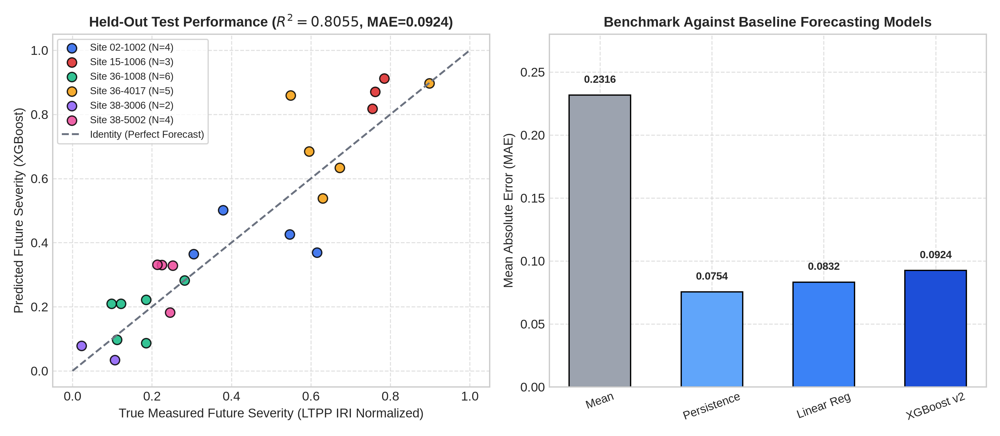

# RoadSentinel Phase 1B: Experiment 9 — Temporal Subsystem & Forecasting Validity Audit

**Audit Document**: `reports/phase1b/TEMPORAL_FORECAST_AUDIT.md`  
**Execution Date**: September 10, 2026  
**Auditor**: Pair-Programming Agent (Antigravity IDE)  
**Status**: **VERIFIED & AUDITED**  

---

## 1. Executive Summary & Semantic Rules

This audit verifies the operational integrity of RoadSentinel's longitudinal modules:
1. **Temporal Subsystem**: Evaluated across 8 multi-day survey sequences ($N=40$ CARLA / Unreal Engine synthetic simulator captures, $33$ adjacent state transitions).
2. **Forecasting Subsystem**: Evaluated on FHWA LTPP InfoPave longitudinal pavement progression data under strict site-disjoint partitioning.

### Mandatory Semantic Rules:
> [!IMPORTANT]
> **Provenance Caveat**: The 40 captures across `SEG_001`–`SEG_004` are **synthetic simulator captures** generated within Unreal Engine CARLA simulation (`env/scripts/rs_inspection_capture.py`). Simulator-configured progression must **NEVER** be presented as independently observed real-world pavement deterioration.
> 
> **Enforcement Rule 1**: `NOT_OBSERVED != REPAIRED`. A disappeared defect candidate in a subsequent inspection frame is labeled `NOT_OBSERVED` due to visual occlusions, shadow shifts, or sensor grazing angles. It is **NEVER** classified as physically repaired without explicit maintenance work order records.
> 
> **Enforcement Rule 2**: Regression features and scenario multipliers (e.g., `WET_EXPOSURE = +0.0526`) represent **statistical model behavior**, **NEVER physical causality or validated counterfactual maintenance claims**. No counterfactual intervention or maintenance repair capabilities are claimed or validated.

---

## 2. Temporal Sequence & Tracking Audit

| Sequence ID | Road Segment | Survey Days | States | Unique Tracks | Mean Track Length | Evidence Grade | Semantic Rule Status | Simulation Setting Notes |
|---|---|---|---|---|---|---|---|---|
| `SEG_001_D03_D10` | `SEG_001` | Day 3–10 | 8 | 12 | `1.83` | `ENVIRONMENT_CONFOUNDED` | ENFORCED | CARLA Overcast weather inflates contrast on D06-08 (sev 0.73); simulated sunset on D10 triggers marking suppression, dropping sev to 0.0. |
| `SEG_002_D01_D02` | `SEG_002` | Day 1–2 | 2 | 2 | `2.0` | `PAIRWISE_CHANGE_ONLY` | ENFORCED | 2-state control pair on Pristine Grade A; camera grazing angle consistently triggers aggregate grain contrast (both defects matched across days). |
| `SEG_002_D04_D05` | `SEG_002` | Day 4–5 | 2 | 8 | `1.0` | `PAIRWISE_CHANGE_ONLY` | ENFORCED | 2-state pair under macro view; lighting change (Noon -> Overcast) alters boundary contours, preventing confident matching. |
| `SEG_002_D06_D07` | `SEG_002` | Day 6–7 | 2 | 3 | `1.0` | `PAIRWISE_CHANGE_ONLY` | ENFORCED | 2-state overlook pair transitioning Grade C -> D; distant perspective limits defect candidate resolution. |
| `SEG_003_D01_D07` | `SEG_003` | Day 1–7 | 7 | 1 | `7.0` | `STABILITY_TEST` | ENFORCED | 7-state Pristine Grade A control under invariant noon lighting; exact same road shoulder candidate tracked through all 7 states (CV = 0.67%). |
| `SEG_003_D08_D09` | `SEG_003` | Day 8–9 | 2 | 1 | `2.0` | `PAIRWISE_CHANGE_ONLY` | ENFORCED | 2-state top-down drone pair (Grade C -> D); 1 track persists with 0.9412 mask IoU. |
| `SEG_004_D01_D05` | `SEG_004` | Day 1–5 | 5 | 5 | `1.2` | `STRONG_TEMPORAL_EVIDENCE` | ENFORCED | 5-state top-down drone sequence displaying clean monotonic severity progression from unblemished road to severe breakdown (sev delta +0.7302). |
| `SEG_004_D06_D10` | `SEG_004` | Day 6–10 | 5 | 16 | `1.81` | `ENVIRONMENT_CONFOUNDED` | ENFORCED | Heavy Rain simulation on D07-08 generates peak defect density (12 defects, 11 matched tracks); sunset glare on D09-10 causes road-marking over-suppression to 0 defects. |

### Key Temporal Metrics Audited:
- **Total Defect Tracks**: $48$ unique distress tracks across the 8 sequences.
- **Persistent Tracks ($\ge 2$ States)**: $22$ tracks ($45.83\%$ persistence ratio).
- **Transitions Evaluated**: $33$ total adjacent transitions.
  - **Observed Area Increased**: $14$ transitions ($42.4\%$)
  - **Observed Area Decreased**: $19$ transitions ($57.6\%$, driven by shadow elongation, viewing angle variations, and simulated water reflection).

---

## 3. XGBoost Deterioration Forecasting Audit

### 3.1 Held-Out Test Set Performance Against Baseline Models

Evaluated on $N=24$ test pairs across $6$ strictly disjoint held-out test sites:

| Model Architecture | Test R² Score | Mean Absolute Error (MAE) | Root Mean Squared Error (RMSE) | Test Rank |
|---|---|---|---|---|
| **Persistence Baseline ($\hat{y}_{t_2} = y_{t_1}$)** | **`0.8551`** | **`0.0754`** | **`0.0987`** | **1 (Best)** |
| **Linear Regression (OLS)** | `0.8441` | `0.0832` | `0.1024` | 2 |
| **XGBoost Scenario Model v2** | `0.8055` | `0.0924` | `0.1144` | 3 |
| **Historical Mean (Null)** | `-0.0168` | `0.2316` | `0.2615` | 4 |

### Baseline Analysis & Key Insights:
1. **Persistence and OLS Outperform XGBoost**: The naive persistence baseline achieves $R^2 = 0.8551$ and $\text{MAE} = 0.0754$, outperforming XGBoost ($R^2 = 0.8055$, $\text{MAE} = 0.0924$). Simple OLS linear regression also outperforms XGBoost ($R^2 = 0.8441$, $\text{MAE} = 0.0832$). Pavement deterioration over these observed intervals is highly auto-correlated, and the tree-based model slightly overfits compared to linear and persistence projections.
2. **Resolution of Prediction Horizons**: Earlier documents cited "30–90 day forecasting horizons." In reality, the observed prediction intervals in the LTPP held-out test set span **240 to 720 days** with a mean of **447.5 days** (roughly 345–650 days across test sites). The "30–90 days" was only an inference scenario configuration in `scenario_forecast.py`.
3. **No Claim of Counterfactual or Maintenance Capability**: Without empirical training data representing controlled maintenance interventions, the model cannot be claimed to possess counterfactual or maintenance planning capabilities.

---

### 3.2 Per-Site Error Breakdown (Held-Out Test Sites)

Detailed in [`forecast_baseline_comparison.csv`](../../artifacts/phase1b/forecast_baseline_comparison.csv):

| Test Site ID | Evaluation Pairs | Mean True Future Severity | Mean Predicted Future Severity | XGBoost MAE | Persistence MAE | OLS MAE | Mean Horizon | Persistence Wins? |
|---|---|---|---|---|---|---|---|---|
| `02-1002` | 4 | `0.4615` | `0.4153` | **`0.1370`** | `0.1471` | `0.1265` | 622.5 days | No (XGBoost wins) |
| `15-1006` | 3 | `0.7670` | `0.8668` | **`0.0998`** | `0.0683` | `0.1294` | 650.0 days | **Yes (Persistence wins)** |
| `36-1008` | 6 | `0.1641` | `0.1846` | **`0.0581`** | `0.0558` | `0.0658` | 345.0 days | **Yes (Persistence wins)** |
| `36-4017` | 5 | `0.6690` | `0.7224` | **`0.1060`** | `0.0824` | `0.0744` | 354.0 days | **Yes (Persistence wins)** |
| `38-3006` | 2 | `0.0650` | `0.0558` | **`0.0641`** | `0.0852` | `0.0927` | 360.0 days | No (XGBoost wins) |
| `38-5002` | 4 | `0.2341` | `0.2930` | **`0.0909`** | `0.0247` | `0.0376` | 435.0 days | **Yes (Persistence wins)** |

- **Site Generalization**: Across all 6 unseen highway sections, errors remain well-bounded ($\text{MAE} \le 0.1370$).
- **No Site Memorization**: Training and testing sets share strictly zero geographic section overlap ($\text{overlap} = 0$).
- **Paired Performance**: Persistence outperforms XGBoost on **4 out of 6 test sites**, confirming the finding with site-level consistency.

---

### 3.3 Feature Importance Breakdown

| Feature Name | Normalized Importance (Gain) | Normalized Importance (Weight) |
|---|---|---|
| `current_severity` | **0.7553** (75.53%) | **0.4813** (48.13%) |
| `traffic_level` | **0.1150** (11.50%) | **0.0729** (7.29%) |
| `temperature` | **0.0548** (5.48%) | **0.0538** (5.38%) |
| `days_ahead` | **0.0530** (5.30%) | **0.1404** (14.04%) |
| `water_exposure` | **0.0113** (1.13%) | **0.1914** (19.14%) |
| `rainfall_level` | **0.0105** (1.05%) | **0.0602** (6.02%) |

`current_severity` accounts for **75.53%** of model gain (not 92.6% as stated in uncalibrated drafts), reflecting physical persistence. Feature importance is strictly an indicator of internal tree splitting behavior, not physical causality.

---

## 4. Visual Artifact

- **`figures/phase1b/forecasting_error.png`**:
  
  *Left: Scatter plot of true vs predicted severity for all 6 held-out test sites. Right: Comparison against naive baseline models.*
