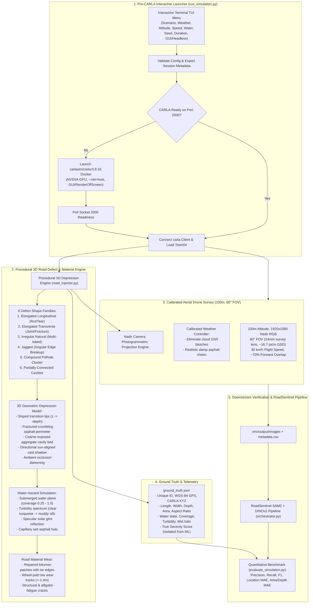

# Implementation Plan: Photorealistic Procedural 3D Road-Depression Simulation & Interactive Pre-CARLA Launcher

Elevate the RoadSentinel CARLA simulation into a photorealistic, physically plausible synthetic aerial road-health testing environment. This update replaces unrealistic square/tile props with true procedural 3D depression geometry across six defect shape families, implements realistic water pooling physics (depth, coverage, turbidity, specular sun glint, and wet capillary halos), adds localized road surface wear, eliminates cloud SSR reflection artifacts on asphalt, standardizes on 100 m drone aerial survey calibration (60° FOV, 1920×1080 nadir), and introduces a curses/TUI pre-CARLA interactive launcher (`python run_simulation.py`) with Docker container lifecycle management.

---

## User Review Required

> [!IMPORTANT]
> **Zero Breaking Changes Guarantee**:
> 1. The existing directory structure (`env/output/images/`, `metadata.csv`, `geo.txt`, `ground_truth.json`) is strictly maintained.
> 2. The downstream RoadSentinel ML pipeline (`orchestrator.py` SAM2 + DINOv2) and benchmark evaluator (`evaluate_simulation.py`) remain 100% compatible.
> 3. Evaluation integrity: Ground truth metadata is generated independently from simulator state and is strictly isolated from the ML inference pipeline.

> [!NOTE]
> **Pre-CARLA Launcher & Docker Orchestration**:
> Running `python run_simulation.py` launches a terminal curses/TUI configuration menu *before* CARLA starts. The launcher automatically detects if CARLA is already running on port 2000 (reusing it) or starts the `carlasim/carla:0.9.16` Docker container with GPU acceleration, waiting for socket readiness before loading Town04 and initiating the drone flight. Advanced CLI flags remain fully supported for automated/headless scripts.

---

## Technical Architecture & Core Innovations



---

## Proposed Changes

### Component 1: Pre-CARLA Interactive TUI Launcher & Docker Manager

#### [NEW] [run_simulation.py](file:///home/nitin-nandakumar/Downloads/roadsentinel/run_simulation.py)
- **Curses/TUI Interactive Menu**:
  - Displays a clean, keyboard-navigable terminal interface (arrow keys, Enter to toggle/cycle, Esc to back/exit) before any CARLA processes or windows start.
  - Interactive selection fields:
    - **Scenario**: `Healthy` | `Moderate` | `Poor` | `Critical`
    - **Weather**: `Clear` | `Overcast` | `Wet` | `Rain` | `Post-Rain` | `Low Light` | `Sunset` | `Early Morning`
    - **Altitude**: `100 m` (Default) | `80 m` | `90 m` | `120 m`
    - **Drone Speed**: `30 km/h` (Default) | `20 km/h` | `10 km/h`
    - **Pothole Water**: `Automatic by Scenario` | `Mostly Dry` | `Mixed` | `Mostly Water-Filled`
    - **Seed**: `Random` | `Fixed Seed (42)` | `Custom Seed`
    - **Duration**: `30 sec` | `60 sec` (Default) | `120 sec` | `Custom`
    - **Rendering**: `GUI` | `Headless`
    - `[ START SIMULATION ]` and `[ EXIT ]`
  - Fallback: Includes an ANSI-interactive mode for non-curses terminal emulators.
  - Full CLI argument override for CI/batch scripts (bypasses menu when flags like `--scenario` or `--no-interactive` are passed).
- **Docker Container Lifecycle Management**:
  - Inspects port 2000 socket and active Docker containers (`docker ps`).
  - If CARLA is already running: connects immediately without restarting.
  - If CARLA is not running: executes `docker run -d --name carla_sim --gpus all --runtime=nvidia --net=host -e DISPLAY=$DISPLAY -v /tmp/.X11-unix:/tmp/.X11-unix:rw carlasim/carla:0.9.16 bash CarlaUE4.sh -nosound -quality-level=Low` (with `-RenderOffScreen` if Headless).
  - Actively polls port 2000 with a progress indicator and configurable timeout (45s).
  - Graceful cleanup: terminates session cleanly upon flight completion or user abort.

---

### Component 2: Procedural 3D Road Depression & Water Hazard Engine

#### [MODIFY] [road_injector.py](file:///home/nitin-nandakumar/Downloads/roadsentinel/env/road_injector.py)
- **Eliminate Square/Brown Tile Props**:
  - Remove all usages of `static.prop.brokentile*` and flat untextured props that looked like square tiles sitting on top of the road.
- **Implement 6 Defect Shape Families**:
  1. `elongated_longitudinal`: Stretched along lane axis (aspect ratio 2.0–3.8), oriented along road heading, mimicking wheel-path tearing/rutting.
  2. `elongated_transverse`: Stretched across lane axis (aspect ratio 2.0–3.5), oriented ~90° across lane, mimicking joint/contraction faults.
  3. `irregular_natural`: Multi-lobed fractal boundary with 4–8 organic concave indentations.
  4. `jagged`: High-frequency angular perimeter cuts with crumbling asphalt margins.
  5. `compound_cluster`: 2 to 4 distinct cavities overlapping or grouped within 1.5 m with shared deteriorated perimeter.
  6. `partially_connected`: Twin cavities connected by a shallow, fractured saddle trough.
- **Procedural 3D Depression Geometry**:
  - Distance-transform based concave bowl depression: $z(r) = -depth \cdot (1 - r/R)^\alpha$.
  - Sloped transition lips with normal gradient shading.
  - Ambient occlusion: exponential cavity darkening towards deep interior floor.
  - Directional shadow: cast internal shadow on opposite wall based on CARLA sun azimuth and altitude.
  - Internal gravel aggregate: procedural Perlin/fractal high-frequency texture representing exposed asphalt sub-base.
- **Water-Filled Pothole Physics (The Main Novelty)**:
  - Submerged horizontal water plane at $z = -depth \cdot (1 - water\_coverage)$.
  - Variable coverage fraction: `0.25` (shallow puddle exposing rocky bed) to `1.0` (brim-full).
  - Turbidity spectrum: `0.0` (clear dark blue-grey with visible aggregate bed) to `1.0` (opaque muddy brown-silt).
  - Specular sun reflection: directional glint highlight aligned with CARLA's sun azimuth angle.
  - Wet perimeter halo: dark glossy moisture ring extending 0.15–0.45 m into surrounding asphalt with soft falloff.
- **Road Surface Degradation**:
  - Repaired rectangular/trapezoidal asphalt patches with dark bitumen sealant borders.
  - Localized wheel-track tire wear marks ($\pm 1.4\text{m}$).
  - Structural cracks: radial edge fractures, longitudinal cracks, transverse cracks, and alligator fatigue cracking patterns.
- **Precise Ground Truth Telemetry**:
  - Preserves complete `ground_truth.json` schema with exact 3D metric dimensions (length, width, max depth, area, aspect ratio), WGS-84 GPS coordinates, shape family, water state (coverage, turbidity, depth, wet halo), and severity score.

---

### Component 3: Weather Calibration & Cloud Artifact Elimination

#### [MODIFY] [config.py](file:///home/nitin-nandakumar/Downloads/roadsentinel/env/config.py)
- **Fix Cloud / SSR Reflection Artifacts**:
  - Problem diagnosed: UE4 screen-space reflections (SSR) with high `wetness` (>50%) and `precipitation_deposits` (>40%) cause low-resolution cumulus clouds in the sky to bounce into the nadir camera as blocky white smudges on the road surface.
  - Solution: Calibrate `WEATHER_PRESETS`:
    - `post_rain`: `cloudiness=20.0`, `wetness=15.0`, `precipitation_deposits=10.0`, `sun_altitude=65.0`, `sun_azimuth=180.0`. Delivers an authentic post-rain damp asphalt sheen without floating cloud blotches.
    - `wet`: `cloudiness=30.0`, `wetness=25.0`, `precipitation_deposits=15.0`, `sun_altitude=55.0`.
    - `clear`: `cloudiness=0.0`, `wetness=0.0`, `sun_altitude=75.0`.
- **Calibrated Camera FOV for 100 m Drone Inspection**:
  - Default `ALTITUDE_M = 100.0`.
  - Default `CAMERA_FOV_DEG = 60.0` (representing a standard 24mm aerial survey lens on DJI Zenmuse/Matrice).
  - Survey analysis: At 100 m altitude with 60° FOV, ground width is 115 m, giving ~16.7 px/m (GSD = 6 cm/px). A 1.5 m defect spans ~25 pixels, providing clear resolution for SAM2 and DINOv2 (which uses a 14×14 patch), whereas the prior 100° FOV reduced defects to <8 pixels.
  - Configurable CLI flag `--fov` added with documentation.

---

### Component 4: Drone Simulator Integration (Live CARLA & Standalone)

#### [MODIFY] [drone_sim.py](file:///home/nitin-nandakumar/Downloads/roadsentinel/env/drone_sim.py)
- **Photorealistic Projection Engine**:
  - Live CARLA Mode: When CARLA nadir camera frames are received, seamlessly projects the procedural 3D depressions, water hazards, and surface wear onto the asphalt at the exact sub-pixel road coordinates corresponding to each defect in `ground_truth.json`.
  - Standalone Mode: Renders identical photorealistic multi-lane highway textures, markings, 3D depressions, and water hazards directly using the PBR synthesis pipeline, ensuring complete visual and telemetry fidelity when offline.
- **HUD & Telemetry Polish**:
  - Displays survey lens FOV (60°), GSD (cm/px), flight altitude (100 m), ground speed (30 km/h), and active defect counts.

---

### Component 5: Documentation & Test Suite

#### [MODIFY] [README.md](file:///home/nitin-nandakumar/Downloads/roadsentinel/README.md)
- Document the new streamlined workflow:
  ```bash
  python run_simulation.py
  ```
  with interactive menu guide, launch sequence, and advanced CLI commands for batch dataset generation.

#### [NEW] [test_interactive_sim.py](file:///home/nitin-nandakumar/Downloads/roadsentinel/road_health_pipeline/tests/test_interactive_sim.py)
- Unit tests covering:
  1. Interactive configuration parser & validation logic.
  2. Scenario monotonicity (Healthy -> Moderate -> Poor -> Critical).
  3. 6 defect shape families generation and geometric validation.
  4. Water state parameters (coverage 0.25–1.0, turbidity, depth, wet halo).
  5. Seed reproducibility (seed=42 generates identical geometry).
  6. Docker socket readiness detection logic.

---

## Verification Plan

### 1. Automated Unit & Integration Tests
Run test suite to verify all existing 17 tests plus new test cases pass:
```bash
./.venv/bin/python road_health_pipeline/tests/run_tests.py
```

### 2. Interactive Launcher Acceptance Test
Verify that running the launcher launches the curses/TUI menu cleanly before CARLA:
```bash
python run_simulation.py --help
python run_simulation.py --scenario poor --weather post_rain --altitude 100 --seed 42 --duration 10 --headless --auto-fly
```

### 3. Visual Quality Acceptance Test (100 m, POOR + POST_RAIN)
Generate aerial imagery at 100 m altitude with POOR + POST_RAIN scenario:
```bash
python run_simulation.py --scenario poor --weather post_rain --altitude 100 --speed 30 --seed 42 --duration 30 --auto-fly
```
Inspect generated images in `env/output/images/`:
- Confirm potholes appear as true irregular 3D depressions with sloped lips, fractured crumbling edges, and dark interiors.
- Confirm water-filled potholes show variable water coverage, turbidity, specular sun glint, and wet capillary halos.
- Confirm no square props or beige tile boxes appear.
- Confirm no cloud reflection blotches appear on the asphalt.

### 4. RoadSentinel ML Pipeline & Quantitative Benchmark
Run the SAM2 + DINOv2 pipeline and evaluate against ground truth:
```bash
./.venv/bin/python orchestrator.py --input-dir ./env/output --no-server
./.venv/bin/python env/evaluate_simulation.py \
    --ground-truth env/output/ground_truth.json \
    --predictions road_health_pipeline/output/analytics_demo/result.json
```
Verify precision, recall, F1, location MAE, area MAE, and depth MAE.
